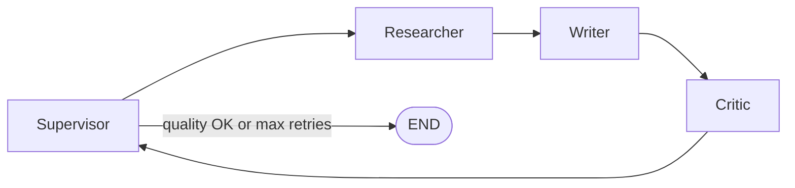

# Maestro

Maestro is a multi-agent research workflow engine. You submit a task (topic or question), and a team of specialized agents researches the subject, writes a markdown report, critiques it, and revises until quality meets a threshold. Results stream over Server-Sent Events (SSE), and completed reports are saved under `output/`.

## How it works

The workflow is built with [LangGraph](https://github.com/langchain-ai/langgraph) and orchestrated by four agents:

| Agent | Role |
|-------|------|
| **Supervisor** | Breaks the task into a plan and routes work to the right agent |
| **Researcher** | Gathers context via Tavily web search and an in-process BM25 knowledge base |
| **Writer** | Produces a structured markdown report from the research brief |
| **Critic** | Scores the draft (0.0–1.0) and returns actionable feedback |



- If `quality_score >= 0.75` (configurable), the run finishes and the draft becomes the final report.
- If quality is low, the critic sends feedback and the writer revises (up to 3 retries by default).
- When a run completes, the report is written to `output/{task}_{score}.md` (spaces in the task become underscores).

## Tech stack

- **API:** FastAPI + Uvicorn (SSE streaming)
- **Orchestration:** LangGraph
- **LLM:** Anthropic Claude (`langchain-anthropic`)
- **Search:** Tavily (optional) + BM25 over a small built-in knowledge base
- **Observability:** LangSmith tracing (optional)

## Prerequisites

- Python 3.9+
- [Anthropic API key](https://console.anthropic.com/) (required)
- [Tavily API key](https://tavily.com/) (recommended for web search; the app still runs without it)
- [LangSmith API key](https://smith.langchain.com/) (optional, for traces)

Redis and PostgreSQL are defined in `docker-compose.yml` for future persistence; they are **not** required to run the API today.

## Local setup

### 1. Clone and enter the project

```bash
git clone <your-repo-url>
cd Maestro
```

### 2. Create a virtual environment

```bash
python3 -m venv .venv
source .venv/bin/activate   # Windows: .venv\Scripts\activate
```

### 3. Install dependencies

```bash
pip install -r requirements.txt
```

### 4. Configure environment variables

Copy the example env file and add your keys:

```bash
cp .env.example .env
```

Edit `.env` — at minimum set:

```env
ANTHROPIC_API_KEY=your_anthropic_api_key_here
```

Optional but useful:

```env
TAVILY_API_KEY=your_tavily_api_key_here
ANTHROPIC_MODEL=claude-sonnet-4-6

# LangSmith tracing
LANGCHAIN_TRACING_V2=true
LANGCHAIN_API_KEY=your_langsmith_api_key_here
LANGCHAIN_PROJECT=maestro
```

### 5. (Optional) Start Redis and Postgres

Only needed if you plan to wire up persistence later:

```bash
docker compose up -d
```

### 6. Run the API server

From the project root (so `app` imports resolve):

```bash
uvicorn app.main:app --reload --host 0.0.0.0 --port 8000
```

- Health check: [http://localhost:8000/health](http://localhost:8000/health)
- Interactive API docs: [http://localhost:8000/docs](http://localhost:8000/docs)

## Using the API

### Start a run

```bash
curl -s -X POST http://localhost:8000/run \
  -H "Content-Type: application/json" \
  -d '{"task": "Write a 3-bullet summary of what LangGraph is"}'
```

Response:

```json
{"run_id": "<uuid>", "status": "pending"}
```

### Stream events

Replace `<run_id>` with the value from the previous response:

```bash
curl -N http://localhost:8000/run/<run_id>/stream
```

Event types include `run_started`, `agent_start`, `agent_end`, `token` (LLM stream chunks), `done`, and `error`. The `done` event includes `final_output`, `quality_score`, `retry_count`, and `output_path`.

### Output files

Completed reports are saved under `output/`, for example:

```text
output/Write_a_3-bullet_summary_of_what_LangGraph_is_0.88.md
```

The filename is derived from the task text and the final quality score. The file contains the markdown report only (no score header in the body).

## Configuration

Settings are loaded from `.env` via `app/config.py`:

| Variable | Default | Description |
|----------|---------|-------------|
| `ANTHROPIC_API_KEY` | — | Required for LLM calls |
| `ANTHROPIC_MODEL` | `claude-sonnet-4-6` | Claude model id |
| `TAVILY_API_KEY` | — | Enables live web search |
| `QUALITY_THRESHOLD` | `0.75` | Minimum score to approve a report |
| `MAX_RETRIES` | `3` | Max critic-driven revision loops |
| `LANGCHAIN_TRACING_V2` | `false` | Enable LangSmith traces |

## Project layout

```text
app/
  main.py              # FastAPI app, run store, SSE streaming
  config.py            # Settings from environment
  output.py            # Save reports to output/
  graph/
    graph.py           # LangGraph definition and routing
    state.py           # Shared agent state
    nodes/             # supervisor, researcher, writer, critic
  tools/
    search.py          # Tavily + BM25 knowledge base
  observability/
    langsmith_tracing.py
tests/                 # pytest suite
output/                # Generated reports (gitignored)
docker-compose.yml     # Redis + Postgres (optional)
```

## Tests

```bash
pytest
```

## License

Add your license here.
