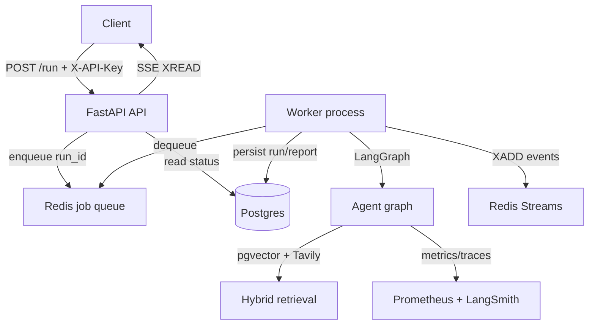

# Maestro

Maestro is a production-style multi-agent research workflow engine. Submit a task; a supervisor-led team of agents researches, writes a markdown report, critiques it, and revises until quality meets a threshold. Runs are durable in Postgres, executed by async Redis workers, and stream live events over SSE.

## Architecture



| Component | Role |
|-----------|------|
| **API** | Auth, rate limits, enqueue jobs, SSE proxy, run status |
| **Worker** | Dequeues jobs, runs LangGraph workflow, publishes events |
| **Postgres** | Durable run state, reports metadata, pgvector document chunks |
| **Redis** | Job queue + per-run event streams for SSE |
| **Prometheus / Grafana** | Agent latency, tokens, queue depth, cost, eval pass rate |

## Agent workflow

| Agent | Role |
|-------|------|
| **Supervisor** | Plans steps and routes to researcher, writer, or critic |
| **Researcher** | Tavily web search + pgvector semantic retrieval (BM25 fallback) |
| **Writer** | Produces a structured markdown report |
| **Critic** | Scores draft quality (0.0–1.0) and returns feedback |

Quality gate: `quality_score >= 0.75` (configurable) or max retries reached.

## Tech stack

- **API:** FastAPI + Uvicorn (SSE)
- **Orchestration:** LangGraph
- **LLM:** Anthropic Claude (`langchain-anthropic`)
- **Retrieval:** pgvector + Tavily + BM25 fallback
- **Persistence:** Postgres (SQLAlchemy async) + Alembic migrations
- **Queue:** Redis (job queue + event streams)
- **Observability:** Prometheus, Grafana, LangSmith (optional)

## Prerequisites

- Python 3.10+ (3.12 recommended)
- Docker and Docker Compose (full stack)
- [Anthropic API key](https://console.anthropic.com/) (required for live runs)
- [Tavily API key](https://tavily.com/) (optional, web search)

## Quick start (Docker)

```bash
cp .env.example .env
# Edit .env: ANTHROPIC_API_KEY, API_KEY

docker compose up --build
```

Services:

| Service | URL |
|---------|-----|
| API | http://localhost:8000/docs |
| Grafana | http://localhost:3000 (admin / admin) |
| Prometheus | http://localhost:9090 |

## API usage

All endpoints except `/health` and `/metrics` require header `X-API-Key`.

### Start a run

```bash
curl -s -X POST http://localhost:8000/run \
  -H "Content-Type: application/json" \
  -H "X-API-Key: dev-api-key-change-me" \
  -d '{"task": "Write a 3-bullet summary of what LangGraph is"}'
```

### Get run status

```bash
curl -s http://localhost:8000/run/<run_id> \
  -H "X-API-Key: dev-api-key-change-me"
```

### Stream events (SSE)

```bash
curl -N http://localhost:8000/run/<run_id>/stream \
  -H "X-API-Key: dev-api-key-change-me"
```

### Fetch completed report

```bash
curl -s http://localhost:8000/run/<run_id>/report \
  -H "X-API-Key: dev-api-key-change-me"
```

### Ingest knowledge for RAG

```bash
curl -s -X POST http://localhost:8000/documents \
  -H "Content-Type: application/json" \
  -H "X-API-Key: dev-api-key-change-me" \
  -d '{"title": "LangGraph notes", "content": "LangGraph builds stateful multi-agent workflows as graphs..."}'
```

## Local development (without Docker)

```bash
python3 -m venv .venv && source .venv/bin/activate
pip install -r requirements.txt
cp .env.example .env

# Start Postgres (pgvector) and Redis, then:
uvicorn app.main:app --reload --host 0.0.0.0 --port 8000
python -m app.worker   # separate terminal
```

Apply migrations:

```bash
alembic upgrade head
```

## Configuration

| Variable | Default | Description |
|----------|---------|-------------|
| `ANTHROPIC_API_KEY` | — | Required for LLM calls |
| `API_KEY` | `dev-api-key-change-me` | Required on all protected endpoints |
| `RATE_LIMIT_RUNS_PER_MINUTE` | `10` | Per-API-key submission limit |
| `DATABASE_URL` | `postgresql+asyncpg://...` | Postgres connection |
| `REDIS_URL` | `redis://localhost:6379` | Redis connection |
| `QUALITY_THRESHOLD` | `0.75` | Minimum critic score to approve |
| `MAX_RETRIES` | `3` | Max revision loops |
| `LLM_INPUT_COST_PER_MILLION` | `3.0` | USD per 1M input tokens (estimate) |
| `LLM_OUTPUT_COST_PER_MILLION` | `15.0` | USD per 1M output tokens (estimate) |

## Observability

- **Prometheus:** `GET /metrics` (API) and worker metrics on `:9100`
- **Grafana:** pre-provisioned dashboard — agent runs, latency, tokens, queue depth, run cost, eval pass rate
- **LangSmith:** set `LANGCHAIN_TRACING_V2=true` and `LANGCHAIN_API_KEY`

### Benchmark notes (local, single worker)

Approximate ranges from development runs (vary by task length and model):

| Metric | Typical range |
|--------|----------------|
| End-to-end workflow | 30–120 s |
| Tokens per run | 8k–25k |
| Estimated cost per run | $0.05–$0.25 USD |

Run a quick load check with concurrent `POST /run` calls and inspect `workflow_duration_seconds` and `queue_depth` in Grafana.

## Tests and evals

```bash
pytest
ruff check app tests scripts
python scripts/run_eval.py --mode mock   # CI-safe golden-task evals
python scripts/run_eval.py --mode live   # full workflow (costs API credits)
```

CI (GitHub Actions) runs lint, unit tests, mocked graph integration tests, and mock evals on every push.

## Project layout

```text
app/
  main.py              # FastAPI API
  worker.py            # Redis worker entrypoint
  runner.py            # LangGraph execution + event publishing
  db/                  # SQLAlchemy models, repository
  queue/               # Redis job queue + event streams
  rag/                 # pgvector ingest + embeddings
  graph/               # LangGraph agents
  evals/               # Golden-task eval harness
  observability/       # Metrics + LangSmith tracing
alembic/               # Database migrations
monitoring/            # Prometheus + Grafana
scripts/run_eval.py    # Eval CLI
```

## License

MIT
